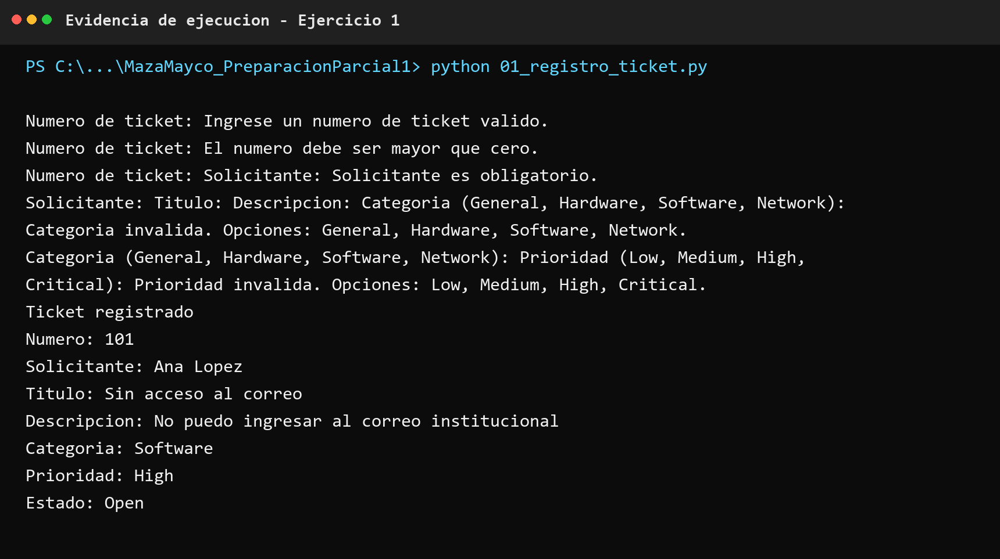
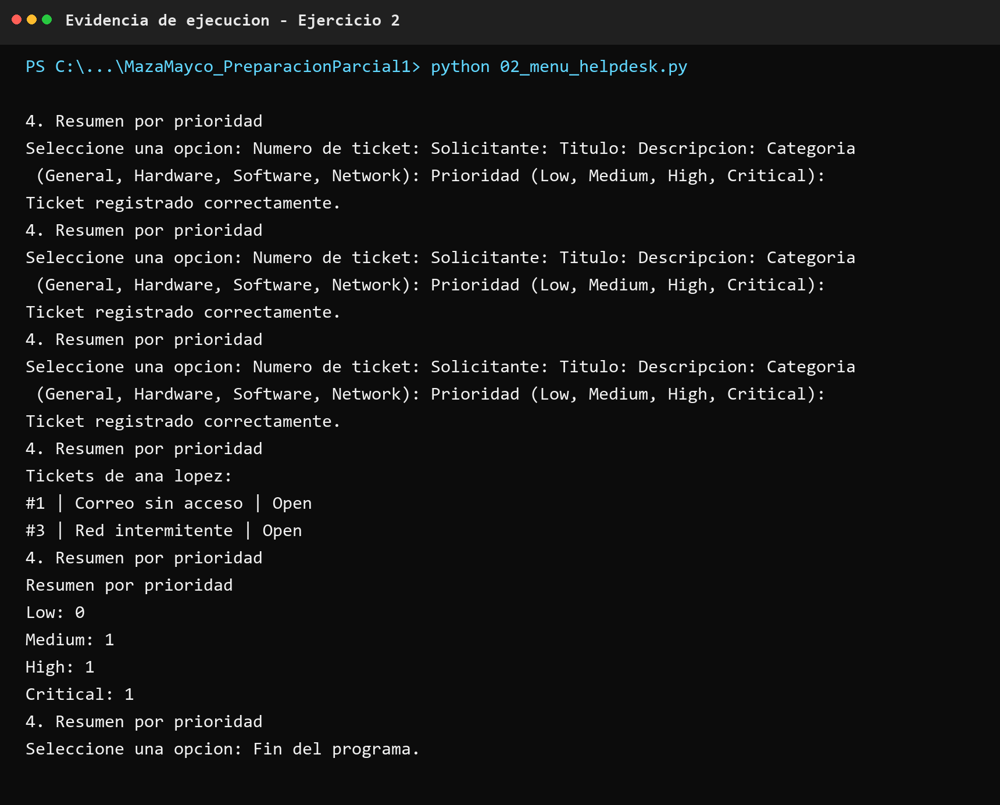
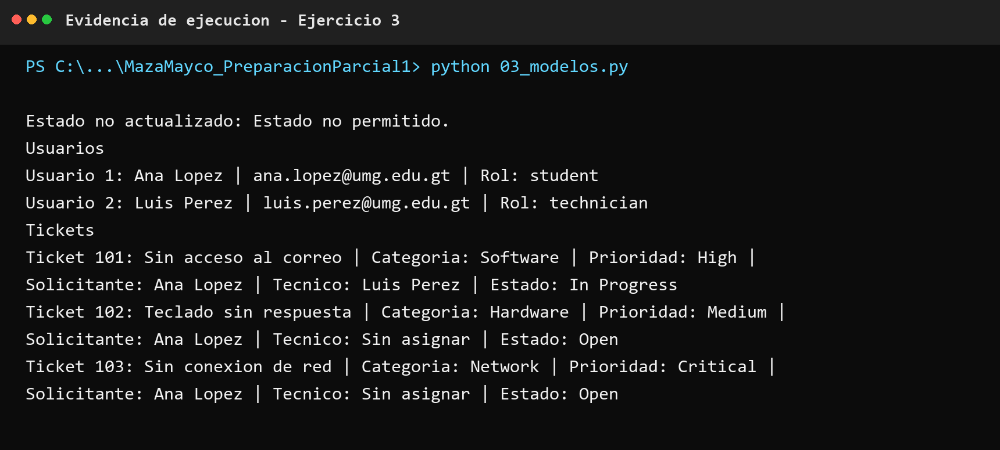
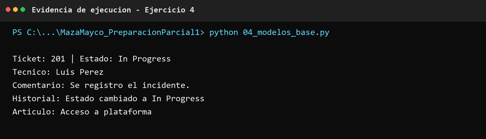
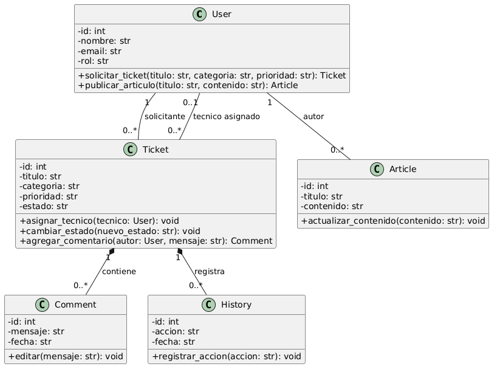
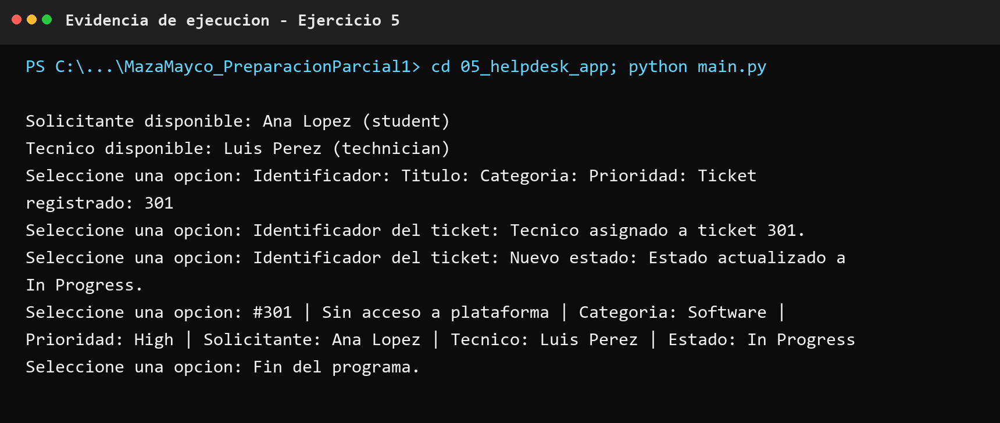

# Preparacion Primer Parcial - HelpDesk EDU

Repositorio publico: https://github.com/mmazatey-ship-it/MazaMayco_PreparacionParcial1

## Archivos

- `Evaluacion_Preparacion_Primer_Parcial_Programacion_II_Python_HelpDesk_EDU.docx`: parcial respondido.
- `01_registro_ticket.py`: registro individual de un ticket por consola.
- `02_menu_helpdesk.py`: menu modular de tickets en memoria.
- `03_modelos.py`: clases `Usuario` y `Ticket`.
- `04_modelo_helpdesk.puml`: diagrama UML del dominio.
- `04_modelos_base.py`: esqueletos Python del modelo UML.
- `04_justificacion_relaciones.md`: justificacion de relaciones, multiplicidades y ciclo de vida.
- `05_helpdesk_app/`: miniaplicacion organizada por modulos.

## Casos probados

1. `01_registro_ticket.py`: numero no valido, campo obligatorio vacio, categoria no permitida, prioridad no permitida y registro valido.
2. `02_menu_helpdesk.py`: registro de tres tickets, busqueda por solicitante sin distinguir mayusculas y minusculas, resumen por prioridad y salida.
3. `03_modelos.py`: asignacion de tecnico, cambio a `In Progress` e intento controlado de estado no permitido.
4. `04_modelos_base.py`: creacion de ticket, comentario, historial y articulo.
5. `05_helpdesk_app`: registro, asignacion de tecnico, cambio de estado y listado del ticket.

## Ejecucion

```text
python 01_registro_ticket.py
python 02_menu_helpdesk.py
python 03_modelos.py
python 04_modelos_base.py
cd 05_helpdesk_app
python main.py
```

## Evidencias de ejecucion












